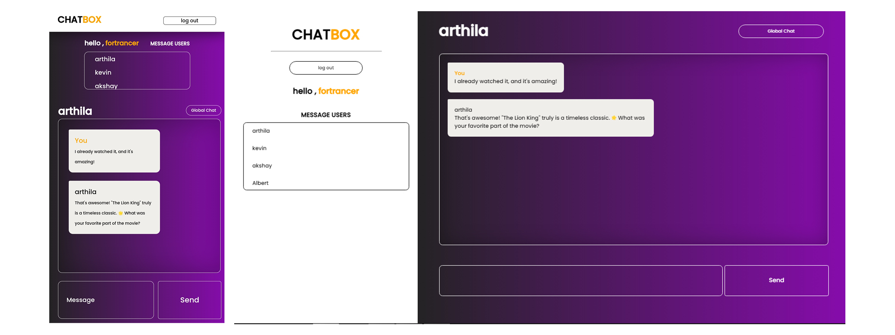

# ChatBox - Online Messaging Platform

ChatBox is an online messaging platform developed using PHP, AJAX, and MySQL. It provides a global chat section where users can interact with each other in real-time, as well as a personal messaging section for private conversations. The platform features secure user authentication, input validation to prevent common XSS attacks, and real-time message updates.

## Features

- **Global Chat**: Engage in real-time conversations with users from around the world in the global chat section.

- **Personal Messaging**: Send private messages to other users through the personal messaging section.

- **User Authentication**: Securely sign up and sign in with user authentication to access the platform's features.

- **Input Validation**: All user inputs are validated and sanitized to prevent common XSS attacks and ensure data integrity.

- **Real-time Messaging**: Messages are updated in real-time, allowing for smooth and dynamic conversations.


## Screenshots

Include screenshots or images to give users a visual preview of The ChatBox platform

### Global Chat
The **Global Chat** feature in ChatBox allows users to engage in real-time conversations with a diverse community of users from around the world. It provides a platform for open discussions, sharing ideas, and making new friends. Users can send and receive text messages


### Personal Messaging
The **Personal Messaging** feature in ChatBox enables users to have private one-on-one conversations with other users. It offers a more intimate and secure space for sharing thoughts, making plans, or simply having a private conversation. Users can send text messages and descriptions privately to specific individuals, ensuring that their communication remains confidential and personalized



### Sign Up
The **Sign Up** feature allows new users to create accounts on ChatBox. During the Sign Up process, users provide essential information such as their username, email address, and password. Input validation checks are applied to ensure that the provided information is valid and secure. Once registered, users can access all the features of ChatBox, including the global chat and personal messaging.


### Sign In
The **Sign In** feature allows users to access their ChatBox accounts securely. Users need to enter their registered credentials, typically their username and password, to log in. The Sign In process ensures that only authorized users can access their personal messages and the global chat. Security measures, such as input validation and password hashing, are implemented to protect user accounts and data.


## Getting Started

Follow these instructions to get a copy of the project up and running on your local machine for development and testing purposes.

1. **Prerequisites**: Ensure you have the following software installed on your machine:

   - Web server (e.g., Apache)
   - PHP
   - MySQL database

2. **Clone the Repository**:

   ```shell
   git clone https://github.com/for-trancer/ChatBox.git
   ```

3. **Database Setup**:

   - Create a MySQL database for ChatBox.
   - Import the provided SQL schema to create the necessary tables.

4. **Configuration**:

   - Update the database connection settings in `config.php` to match your local database setup.

5. **Run the Application**:

   Start your web server and open the ChatBox application in your web browser.

## Built With

- PHP - Backend server scripting language.
- AJAX - Asynchronous JavaScript for real-time updates.
- MySQL - Database management system.
- HTML/CSS - Frontend structure and styling.

## Contributing

Please read [CONTRIBUTING.md](CONTRIBUTING.md) for details on our code of conduct, and the process for submitting pull requests to us.

## License

This project is licensed under the MIT License - see the [LICENSE.md](LICENSE.md) file for details.

## Acknowledgments

- Special thanks to ChatGPT for their contributions to the project.

## Contact

If you have any questions or suggestions, please feel free to contact me at [mrfortrancer@gmail.com].

Happy chatting!
